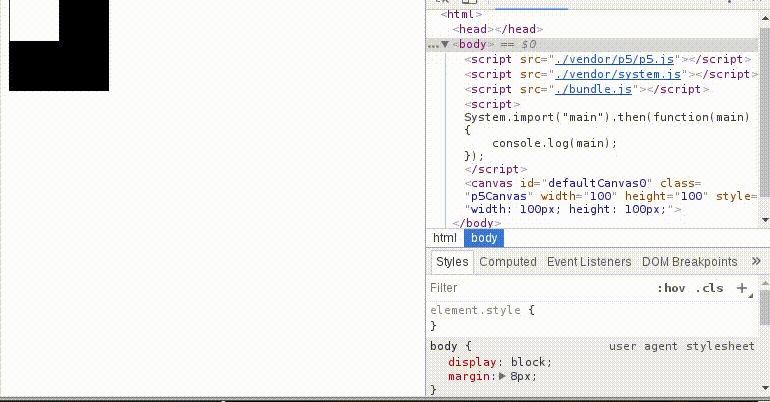

# no-alttabf5
A python tool to refresh the browser when a file is modified.



# installation
1. Download [binary release](https://github.com/nvlled/no-alttabf5/releases/download/v1.0/no-alttabf5)
2. chmod 755 no-alttabf5
3. ./no-alttabf5 -h

or

1. Download this repository
2. pip install -r requirements.txt
3. python noalttab5.py -h


## Sample Usage
```bash
# reload browser when file1.txt or file2.txt changes
$ no-alttabf5 file1.txt file2.txt

# reload browser when file1.txt is modified and
# the selected window has a name that matches ".*RELOAD.*"
$ no-alttabf5 --winpat ".*RELOAD.*" file1.txt

```
Use -h to see other options.
